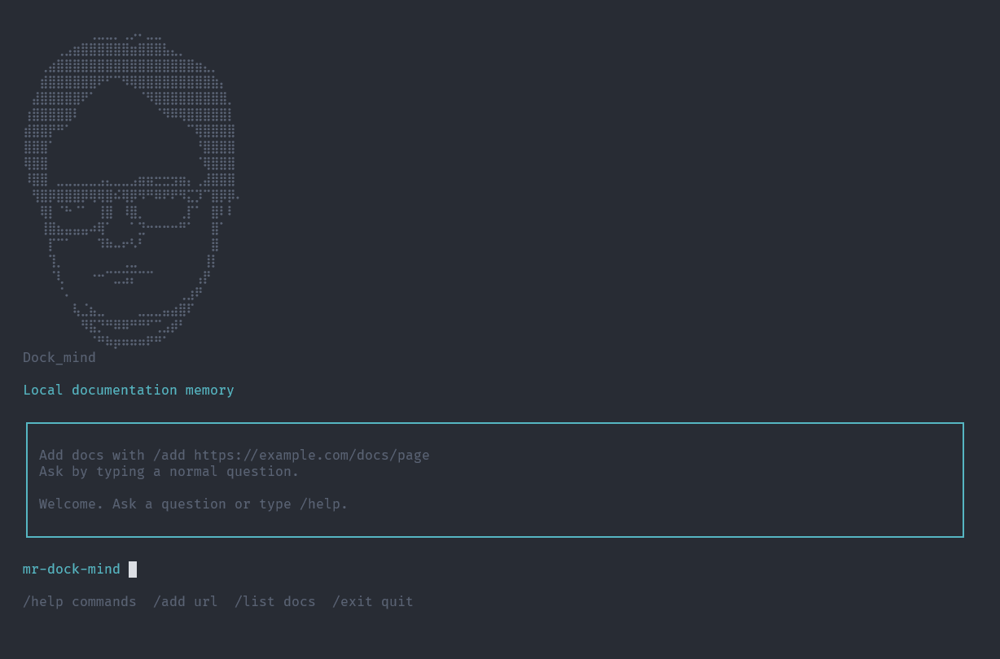

# Mr. Dock_mind

Mr Dock_mind es un sistema RAG local en formato CLI para cargar documentacion via web, convertirla en conocimiento consultable y hacer preguntas sobre ella desde la terminal.

Esta construido con TypeScript y funciona como una pequena memoria tecnica local: descarga paginas de documentacion, limpia el HTML, divide el contenido en fragmentos, genera embeddings, los guarda en una base de datos SQLite local y despues recupera los fragmentos mas relevantes para responder usando contexto real.

La idea es sencilla: traer documentacion a tu maquina, indexarla una vez y poder preguntarle como si tuvieras un asistente especializado en esos docs, sin depender de una base vectorial externa ni de servicios como Pinecone, Supabase, LangChain o LlamaIndex.


## Version Alpha 

La version actual puede:

- Descargar una pagina de documentacion desde una URL.
- Extraer texto legible desde HTML usando Cheerio.
- Dividir el texto en chunks.
- Generar embeddings de esos chunks con OpenAI.
- Guardar documentos, chunks y vectores en una base SQLite local.
- Buscar semanticamente los chunks mas relevantes para una pregunta.
- Construir un contexto RAG con los fragmentos recuperados.
- Generar una respuesta usando solo la documentacion local indexada.
- Mostrar las URLs fuente.
- Ejecutarse como comandos directos de CLI o como interfaz interactiva en terminal.

## Requisitos

- Node.js 20 o superior.
- pnpm 11.4.0.
- Una API key de OpenAI. 

## Configuracion

Instala las dependencias:

```bash
pnpm install
```

Crea un archivo `.env` en la raiz del proyecto:

```bash
OPENAI_API_KEY=
```

Pon tu APIKEY despues de `OPENAI_API_KEY=`.


## Comandos de Desarrollo

Comprobar tipos de TypeScript:

```bash
pnpm typecheck
```

Ejecutar tests:

```bash
pnpm test
```

Compilar el proyecto:

```bash
pnpm build
```

Ejecutar el CLI en desarrollo:

```bash
pnpm exec tsx src/main.ts --help
```
## Uso del CLI (Comandos de la interface grafica)


Abrir la interfaz interactiva en terminal:

```bash
pnpm exec tsx src/main.ts
```


Anadir una pagina de documentacion:

```bash
/add https://docs.astro.build/en/guides/content-collections/
```


Hacer una pregunta:

```bash
como funciona astro?
```

Listar paginas guardadas:

```bash
/list
```

Salir del CLI:

```bash
/exit
```

Comando de ayuda:

```bash
/help
```

## Uso del CLI (sin usar la interface grafica)

Anadir una pagina de documentacion:

```bash
pnpm exec tsx src/main.ts add https://docs.astro.build/en/guides/content-collections/
```

Listar paginas guardadas:

```bash
pnpm exec tsx src/main.ts list
```

Hacer una pregunta:

```bash
pnpm exec tsx src/main.ts ask como creo una coleccion de contenido
```

Abrir la interfaz interactiva en terminal:

```bash
pnpm exec tsx src/main.ts
```

Dentro de la interfaz interactiva:

```text
/help
/list
/add https://docs.astro.build/en/guides/content-collections/
como creo una coleccion de contenido
/exit
```

## Datos Locales

Mr Dock_mind guarda los datos locales en:

```text
.mr-dock-mind/mr-dock-mind.sqlite
```

Ese directorio esta ignorado por git.

## Arquitectura

Areas principales:

- `src/main.ts`: punto de entrada del CLI con Commander.
- `src/ui/`: interfaz interactiva en terminal construida con Ink.
- `src/config/`: carga y validacion de variables de entorno.
- `src/docs/`: descarga de HTML, extraccion de texto y chunking.
- `src/db/`: configuracion de SQLite y repositorios.
- `src/openai/`: llamadas al cliente de OpenAI para respuestas y embeddings.
- `src/search/`: busqueda por similitud vectorial.

Flujo actual de datos:

```text
add <url>
  -> descargar HTML
  -> extraer texto legible
  -> dividir en chunks
  -> crear embeddings
  -> guardar documento y chunks en SQLite

ask <pregunta>
  -> crear embedding de la pregunta
  -> cargar chunks con embeddings
  -> ordenar chunks por similitud coseno
  -> enviar pregunta y contexto a OpenAI
  -> mostrar respuesta y URLs fuente
```

## Progreso de Tareas del MVP

Completado:

- Inicializar proyecto con pnpm.
- Configurar TypeScript, scripts y estructura del proyecto.
- Crear `mr-dock-mind --help`.
- Crear comando `ask`.
- Cargar `.env` y validar `OPENAI_API_KEY`.
- Conectar el CLI con OpenAI.
- Crear `add <url>`.
- Descargar HTML.
- Extraer texto con Cheerio.
- Crear SQLite y guardar paginas.
- Listar paginas guardadas.
- Dividir paginas en chunks.
- Generar embeddings.
- Guardar embeddings.
- Buscar chunks similares.
- Responder usando chunks recuperados.
- Mostrar URLs fuente.
- Mejorar mensajes de terminal.
- Anadir interfaz interactiva en terminal.
- Anadir tests para chunking y busqueda por similitud.

Proximas tareas utiles:

- Refactorizar la logica compartida para que los comandos CLI y la UI de Ink reutilicen los mismos servicios.
- Mejorar el formato de respuestas largas en terminal.
- Anadir un comando para resetear o borrar datos locales.
- Mas adelante: reemplazar el almacenamiento JSON de vectores por `sqlite-vec`.

## Notas
Esto es una version MVP en estado Alpha.
Por ahora, los embeddings se guardan como JSON en SQLite. Esto mantiene el MVP facil de entender antes de introducir extensiones vectoriales.
